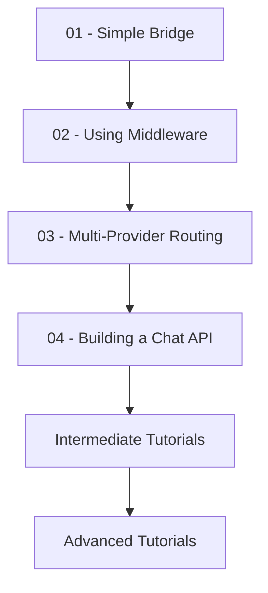

# Tutorials

Learn ai.matey through hands-on tutorials, progressing from beginner to advanced topics.

## Beginner Tutorials

Perfect for getting started with ai.matey fundamentals:

### [01 - Simple Bridge](/tutorials/beginner/simple-bridge)
Build your first Bridge connecting OpenAI format to Anthropic's Claude. Learn the core concept of frontend and backend adapters.

**You'll learn:**
- What a Bridge is and why it's useful
- How to configure frontend and backend adapters
- Making your first AI request
- Understanding the response format

**Time:** 10 minutes

---

### [02 - Using Middleware](/tutorials/beginner/using-middleware)
Add logging, caching, and retry middleware to make your Bridge production-ready.

**You'll learn:**
- What middleware is and how it works
- Adding logging to track requests
- Implementing caching to reduce costs
- Retry logic for resilience

**Time:** 15 minutes

---

### [03 - Multi-Provider Routing](/tutorials/beginner/multi-provider)
Use the Router to automatically switch between multiple AI providers.

**You'll learn:**
- What the Router is and when to use it
- Setting up multiple backend providers
- Implementing round-robin load balancing
- Automatic failover on errors

**Time:** 20 minutes

---

### [04 - Building a Chat API](/tutorials/beginner/building-chat-api)
Create a production-ready HTTP API server with Express and ai.matey.

**You'll learn:**
- Setting up an Express server
- Handling chat endpoints
- Streaming responses
- Error handling and validation

**Time:** 25 minutes

---

## Intermediate Tutorials

Coming soon! These will cover:
- Custom middleware development
- Advanced routing strategies
- Cost optimization patterns
- WebSocket integration
- React integration with hooks

## Advanced Tutorials

Coming soon! These will cover:
- Building custom adapters
- Semantic drift handling
- Multi-tenant architectures
- Edge deployment
- Performance optimization

---

## Learning Path

We recommend following the tutorials in order:

## Prerequisites

Before starting these tutorials, you should have:

- **Node.js 18+** installed
- **npm or yarn** package manager
- Basic **TypeScript/JavaScript** knowledge
- At least one **AI provider API key** (OpenAI, Anthropic, etc.)

## Getting Help

If you get stuck:

1. Check the [API Reference](/api)
2. Browse the [Examples](/examples)
3. Review [Integration Patterns](/patterns)
4. Open an issue on [GitHub](https://github.com/johnhenry/ai.matey/issues)

---

**Ready to start?** Begin with [Tutorial 01: Simple Bridge](/tutorials/beginner/simple-bridge)
